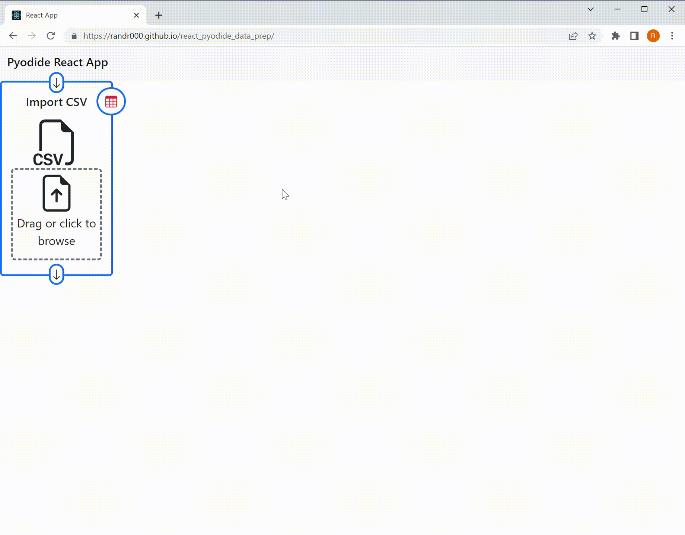
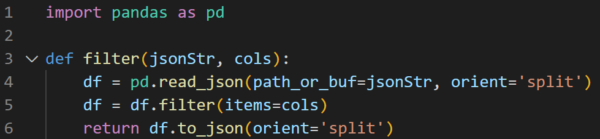
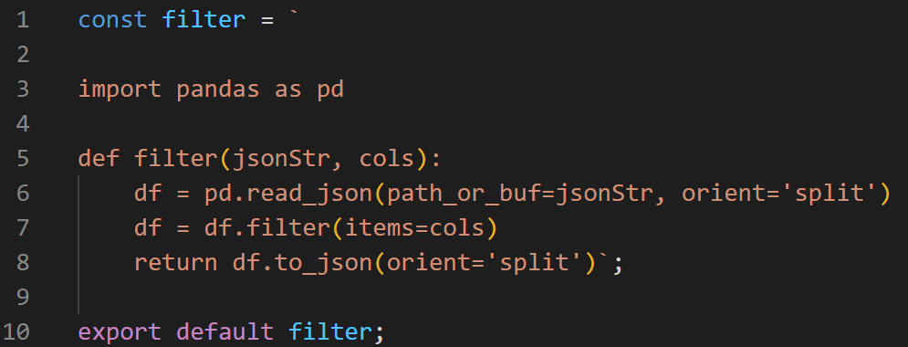
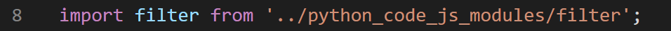
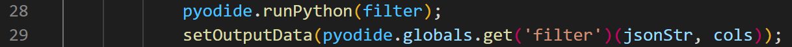

# Python [pandas](https://pandas.pydata.org/) in the Browser

Live GitHub Pages Link: https://randr000.github.io/react_pyodide_data_prep/

This project is a prototype of a drag and drop data preparation app using python and react. All python code is completely run in the browser using [pyodide](https://pyodide.org/en/stable/).

## Functionality

The homepage of the site just displays a component that allows one to import a CSV file.

To import the file, a user can click to browse for the file or drag it over the drop zone. A component to filter columns automatically renders, however, it will not be like this in the final product. The idea is for a user to drag in the components they need in order to accomplish a task.

The components can also be dragged to different areas of the window. Directional arrows connect the components and show in what direction the data is flowing.

A user can filter the columns they need by clicking on the checkboxes.

Users can also toggle showing and hiding the table of each component by clicking on the table icon on the upper right of each component. Currently, the tables are only limited to displaying the first 5 rows of data since anymore can cause the display to become unwieldy.

## Python Code

In order to run python code using pyodide, the code needs to be written as a string. To make writing the code easier, I created a folder called "python_code" in project's root directory. Each component's python code is saved in a separate .py file. Running `node py-to-js-mods.js` from the project's root directory, coverts the python files into javascript files in /src/python_code_js_modules that then allows the python functions to be imported similar to javascript modules and then ran using pyodide. Using this approach will allow me in the future to use a python testing framework to test the python code independent of the javascript code.

Here are the contents of the filter.py file used for the filter component:

Here are the contents of the filter.js file after running `node py-to-js-mods.js`:

Note how the python code has been converted into a string, loaded into a variable, and then exported.

Here is how the python code string is imported into the Filter.jsx component:

Lastly, this is how the python code is ran:

In line 28, pyodide is loading the filter function that was originally defined in the filter.py file.

In line 29, the filter function is called and has arguments passed into it. The filtered dataframe is returned as json.

## Available Scripts

If you would like to run this locally, you can run:

### `npm start`

Runs the app in the development mode.\
Open [http://localhost:3000](http://localhost:3000) to view it in your browser.

The page will reload when you make changes.\
You may also see any lint errors in the console.

## Special Thanks

Without these packages, creating this would have been a lot more difficult.

[react-draggable](https://www.npmjs.com/package/react-draggable)

[react-xarrows](https://www.npmjs.com/package/react-xarrows)