# Pyodide React App with [Pandas](https://pandas.pydata.org/) in the Browser

Live GitHub Pages Link: https://randr000.github.io/react_pyodide_data_prep/

This project uses [pyodide](https://pyodide.org/en/stable/) to allow users to create data pipelines, plotting of data, and machine learning in the browser with Python. All data and Python is run on the front-end. The app uses draggable components and little to no knowledge of code is necessary in order for a user to create a data pipeline.

## User Guide

Upon the site loading, the user has many options to choose from in the navbar. The left side of the navbar contains the data component buttons. The middle contains a file upload input where a user can upload a previously downloaded data pipeline. The right hand side includes some utility buttons allowing a user to show/hide all tables, download the current state of the application, and remove all data components.

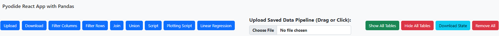

### Data Components

#### Upload

Users can upload a file in the following formats:
- xlsx
- csv
- txt
- json

If a json file is uploaded, the data must have a format of 'split' or 'records'. Click [here](https://pandas.pydata.org/docs/reference/api/pandas.read_json.html) to see how these JSON string formats are structured.

Max Sources: N/A

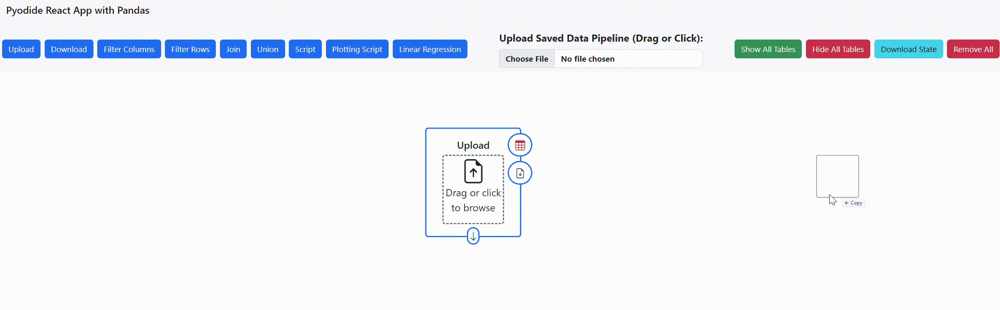

#### Download

Users can download the table data by checking the boxes next to the file format they want downloaded and then click the download icon.

Max Sources: 1

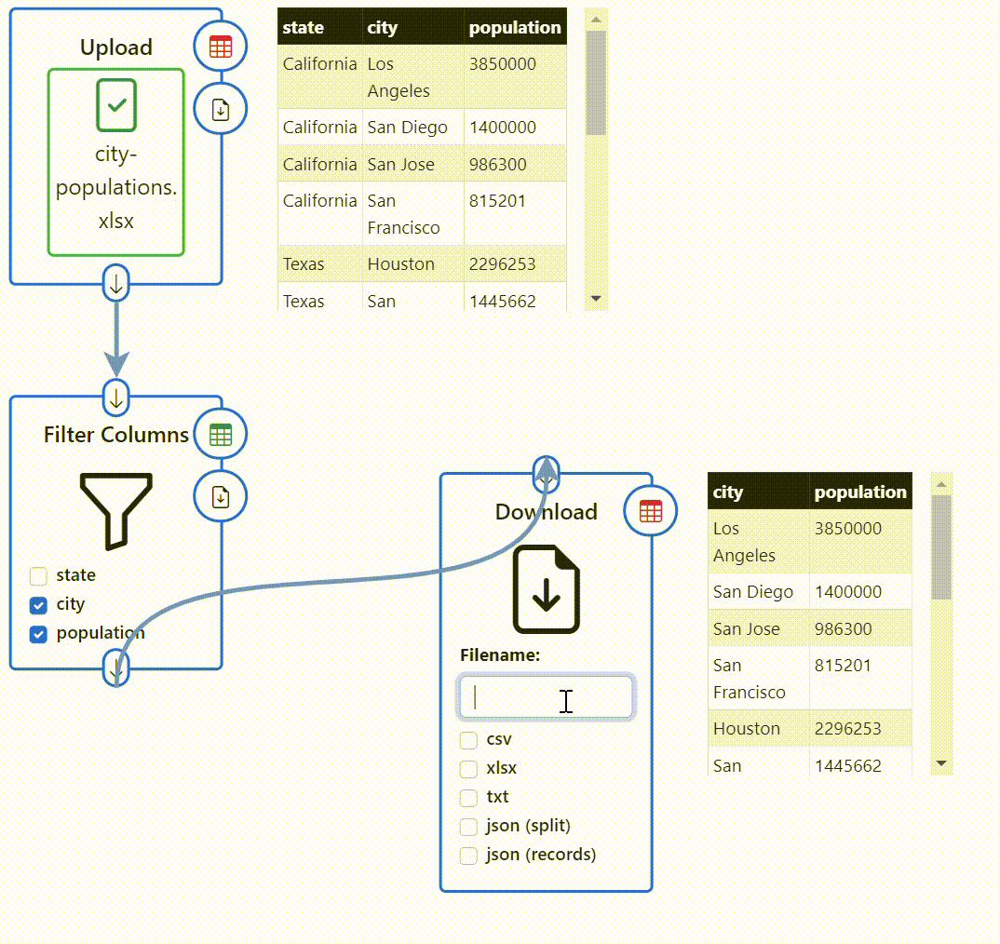

#### Filter Columns

Users can filter columns by checking and unchecking the boxes next to the column names.

Max Sources: 1

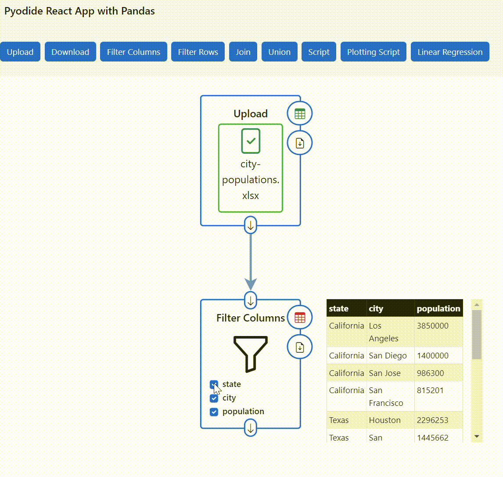

#### Filter Rows

Users can filter rows by selecting the column that contains the value they want to filter by, selecting the correct operator, and entering the value to filter by.

Max Sources: 1

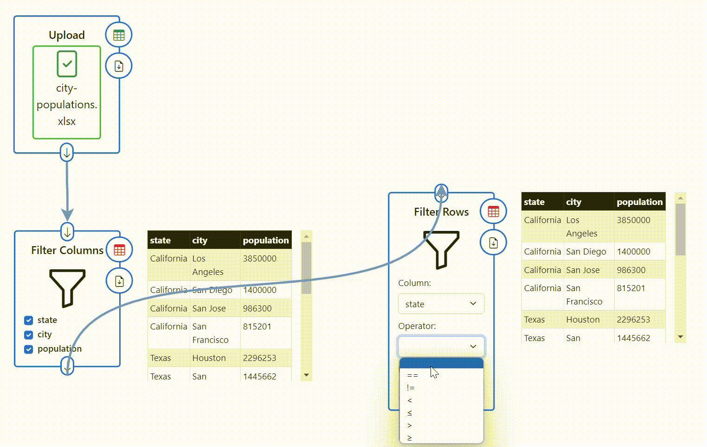

#### Join

Users can join tables using one of the following types of [joins](https://pandas.pydata.org/docs/reference/api/pandas.merge.html):

- Left
- Right
- Inner
- Outer
- Cross

Users can type the suffixes to use for columns from both tables with the same name by typing the suffixes in the Left and Right Suffix text boxes.

Max Sources: 2

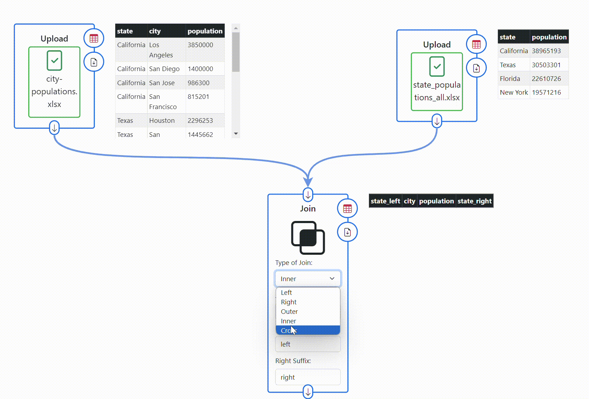

#### Union

Users can combine data similar to a SQL [Union](https://www.geeksforgeeks.org/sql-union-operator/).

Max Sources: Unlimited

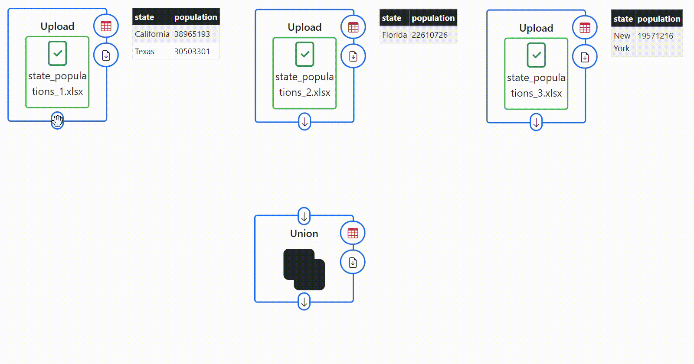

#### Script

The script component allows a user to type in a custom python script to modify the data.

All source data is is stored in the variable df_list as a list of pandas dataframes. The first dataframe of df_list is also stored in the df variable.

While multiple dataframes can be passed to the script component, only one dataframe will be outputed. Do not use the return statement to output a dataframe. Instead, just store it in the df variable.

Do not do this:
```py
return df
```
Do this instead:
```py
df = <df modifications>
```
These are the first six lines of the script that are preloaded:
```py
1 import pandas as pd
2 import numpy as np
3 from io import StringIO
4 import json
5 df_list = [pd.read_json(path_or_buf=StringIO(json.dumps(data)), orient="split") for data in json.loads(jsonStr)]
6 df = df_list[0]
```

Max Sources: Unlimited

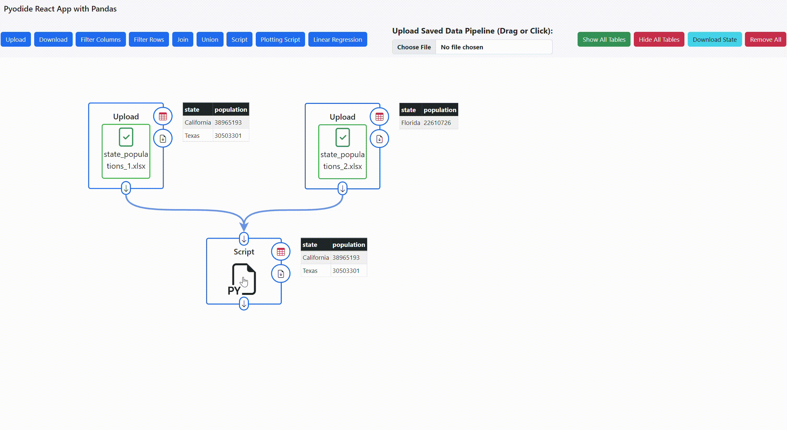

The code editor starts with line 7 in order to make it easier to determine what line an error occured in a user's script.

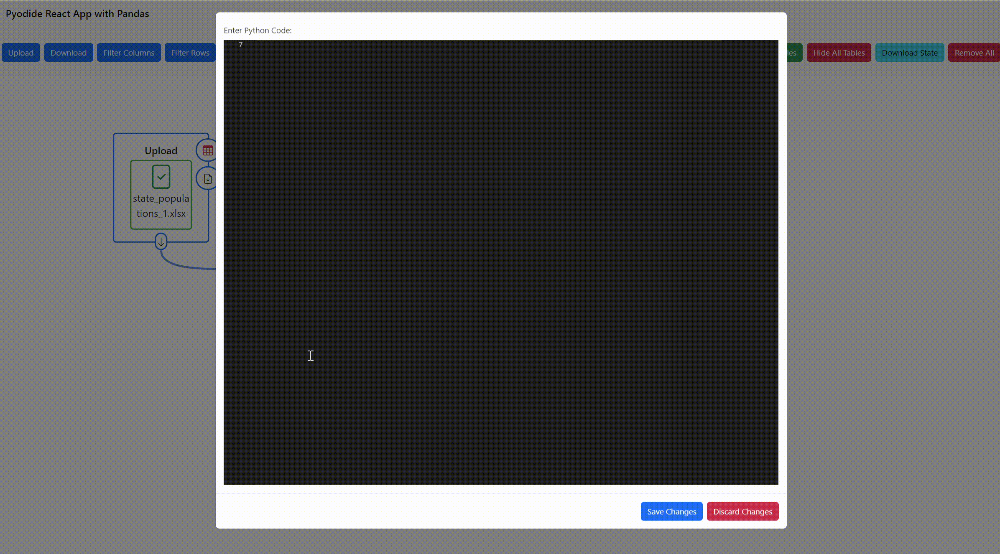


#### Plotting Script

The plotting script component allows a user to plot data using matplotlib and by writing a custom script.

These are the first nine lines of the script that are preloaded:
```py
1 import pandas as pd
2 import numpy as np
3 import matplotlib.pyplot as plt
4 import matplotlib
5 matplotlib.use("module://matplotlib.backends.html5_canvas_backend")
6 from io import StringIO
7 import json
8 df_list = [pd.read_json(path_or_buf=StringIO(json.dumps(data)), orient="split") for data in json.loads(jsonStr)]
9 df = df_list[0]
```

A user can plot data without using the source data and can plot multiple plots. Must call plt.show().

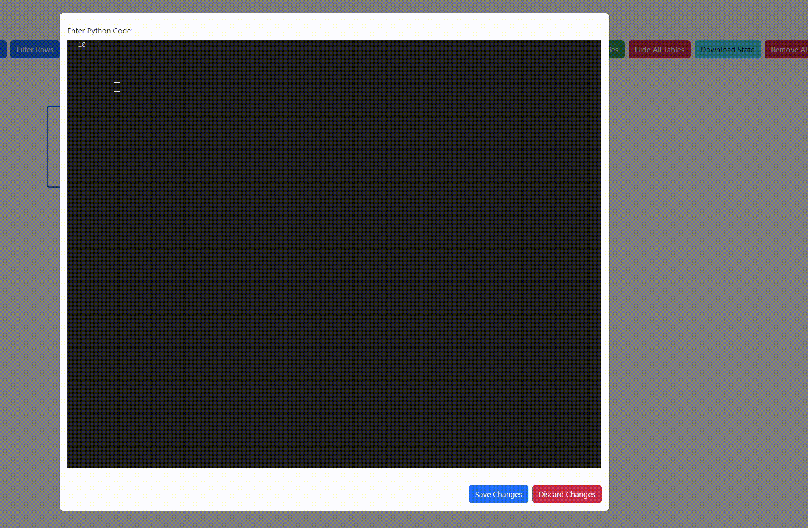

If a user wants to plot the data from the source dataframes, then they would get the data from the df_list or df variables. The df_list variable is a list of pandas dataframes while df is just a reference to the first dataframe. No data is outputed with this component. Must call plt.show().

A user can show/hide the plot by clicking on the plot icon pill.

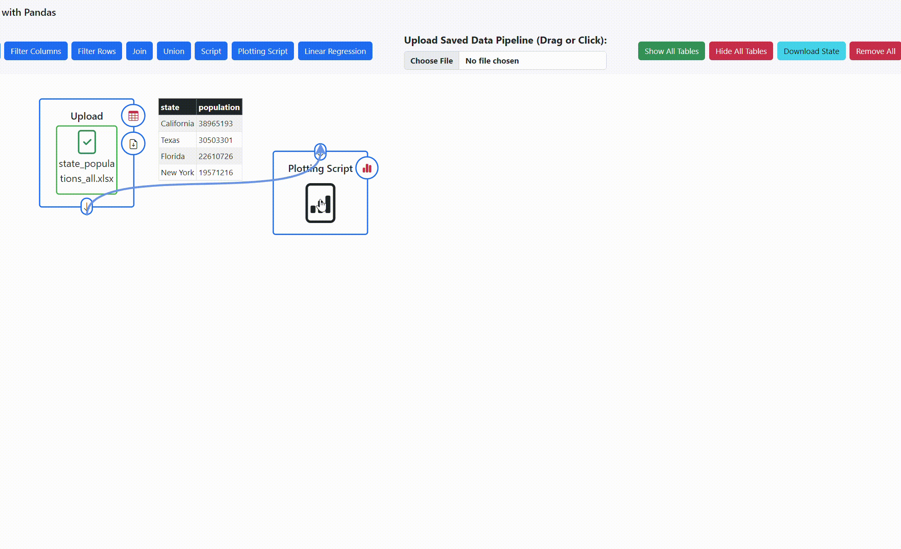

The code editor starts with line 10 in order to make it easier to determine what line an error occured in a user's script.

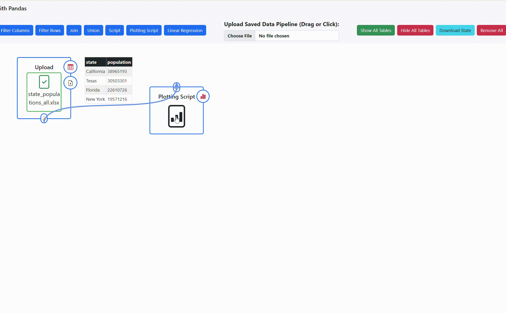

Max Sources: Unlimited

#### Linear Regression

The linear regression component allows a user to create a linear regression model using multiple independent variables. The user can then make predictions.

Note: The prediction values are not saved when downloading the data pipeline but the trained model is.

Max Sources: 1


### User Actions

#### Connecting Data Components

A user can connect two data components by clicking the bottom arrow pill. Any components that can be connected to it will have its top arrow pill turn a green color. The user then clicks on the top green arrow pill to connect the components.

The user can then disconnect components by clicking the red x located in the middle of the connecting arrow. The red x will apear after hovering over it with the mouse.

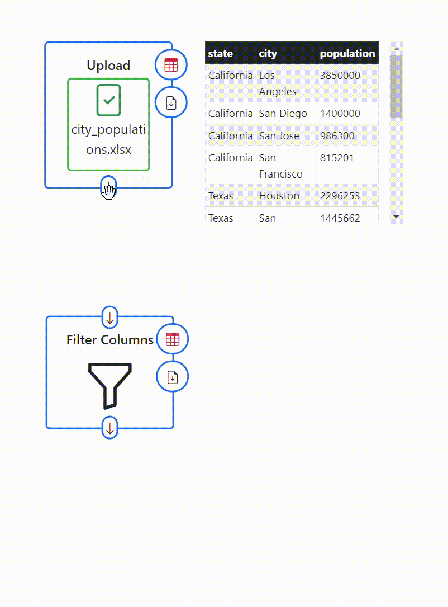

#### File Download

If the user wishes to download data without using the download component they can do so. By clicking on the download pill, a form will appear allowing the user to select the file name and file formats. They then can download the file(s) by clicking the download icon.

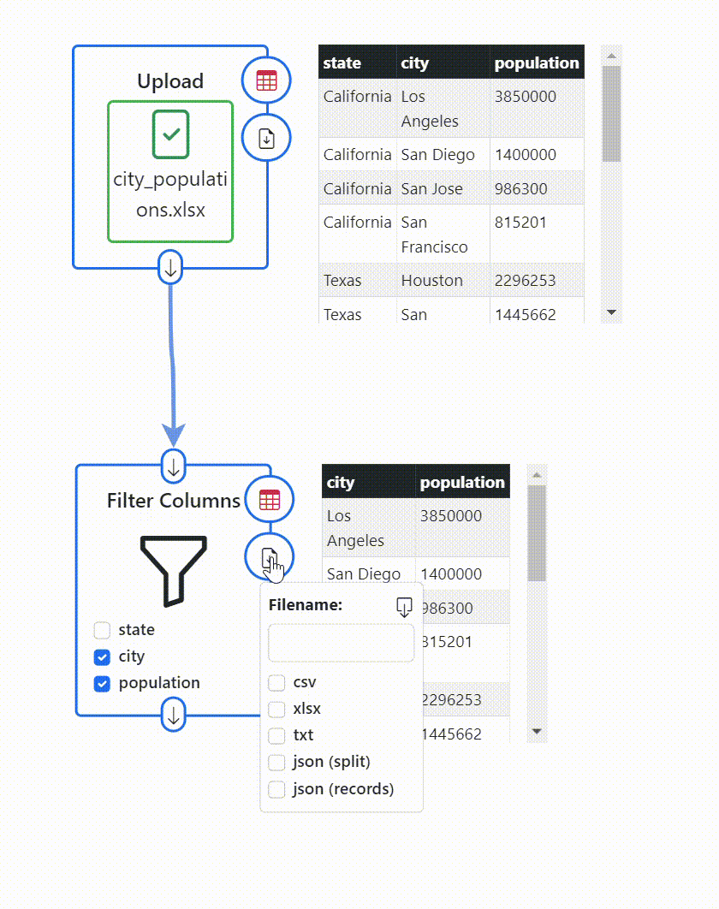

#### Show/Hide Table or Plot

A user can show or hide all tables by clicking on the Show All Tables or Hide All Tables buttons. This will also show or hide any plots. Alternatively, a user can click on the table pill in any individual data component to show or hide any individual table.

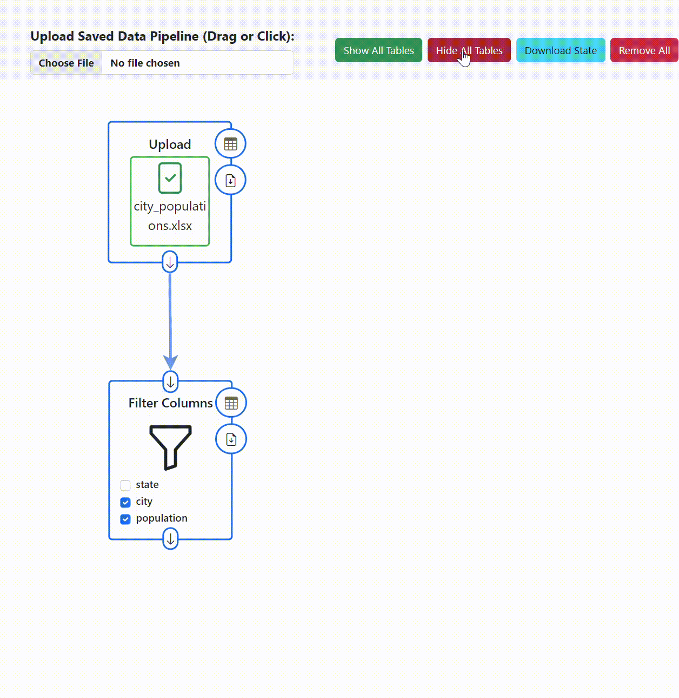

#### Download State

A user can download the current state of the data pipeline by clicking on the Download State button. This will bring up the file picker where the user can select the file name and where to save the file. The downloaded file will be a JSON file.

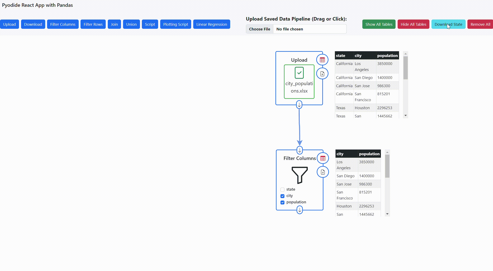

#### Remove All

By clicking on Remove All, all the data components currently in the viewport will disappear and the application state will reset. Alternatively, a user can delete any individual component by hovering the mouse on its top left corner and then clicking the red x when it appears.

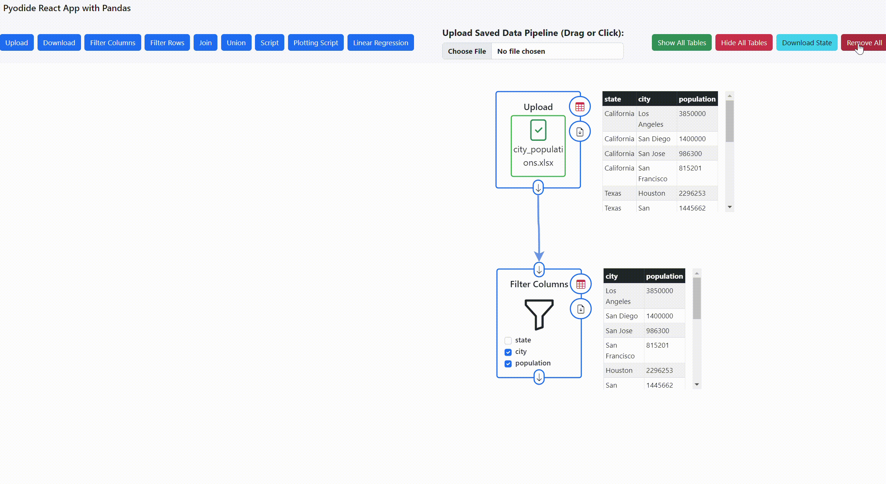

#### Upload Pipeline

A user can upload a previously downloaded data pipeline.

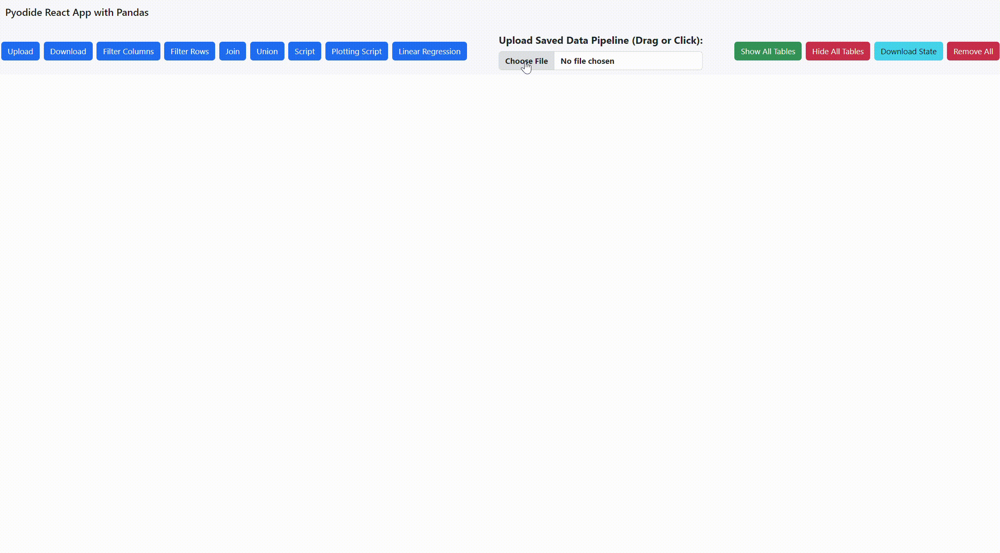

## Developer Guide

The components are built using React and styled using Bootstrap.

### App State

The application state is managed using React's built-in Context API.

Default State:

```js
{
    isDragging: false,
    isDraggingDisabled: false,
    showAllTables: false,
    hideAllTables: false,
    nextID: 0,
    connectComponents: false,
    components: new Map(),
    arrows: new Map(),
}
```

isDragging - (bool) True when a data component is being dragged and false when not. Used to cancel mouse actions when a component is finished dragging.

isDraggingDisabled - (bool) True when data component dragging is disabled and false when not. Used to disable dragging when mouse is over certain components such as text inputs.

showAllTables: - (bool) True when all tables and plots are shown, and false when at least one table or plot is hidden.

hideAllTables - (bool) True when all tables and plots are hidden, and false when at least one table or plot is shown.

Note: showAllTables and hideAllTables cannot be true at the same time.

nextID - (int) Would be the next value to use as a unique React component key for the data components.

connectComponents - (bool) True when a user clicks on the down arrow pill to allow for data components to be connected and false when a user connects two data components or cancels connecting them.

components - (Map) Contains a map of all data components rendered to the screen. The key is an integer and is the nextID used when the component was created.

arrows - (Map) Contains a map of all arrows rendered to the screen. The key is a string containing the nextIDs used when the data components were created and if they are the source (btm) or target (top) component. Ex. '0-btm_1-top'

### Pyodide Instance

The pyodide instance is loaded and stored in a separate pyodide context. The PyodideContextProvider component returns the pyodide instance in a variable called pyodide and another variable called isPyodideLoaded that is true when pyodide has been successfully loaded and false when not.

The following Python packages are also loaded when pyodide is loaded:

- pandas
- numpy
- matplotlib
- scikit-learn
- cloudpickle

### Data Component

All data components are wrapped with the DataComponentWrapper component.

These are its default prop values:

```js
const DataComponentWrapper = ({
    children,
    compID,
    cardTitle = 'Blank',
    iconClassNames = '',
    iconOnClick = () => {},
    canHaveSources = true,
    file = null,
    maxSources = 1,
    canHaveTargets = true,
    updateTargetData = false,
    transformTargetData = false,
    targetDataDeps = [],
    canHaveDownloadPill = true,
    canHaveTablePill = true,
    dataOutputType = 'table',
    plotScript = '',
    setScriptingError = false
}) => {...}
```
children - React's built-in children prop. It will contain all the unique components defined for each data component.

compID - (int) Is the nextID used when the data component was created.

cardTitle - (string) The name of the data component displayed to user.

iconClassNames - (string) The classes used to determine what bootstrap or font awesome icon to display.

iconOnClick - (function) The function to be used for the data component icon's onClick event listener.

canHaveSources - (bool) True if a component can have other components as sources, false if not.

file - (file) When a component can not have source data from another component, then its source data is from an uploaded file.

maxSources - (int) The maximum number of component data sources a component can have.

canHaveTargets - (bool) True if a component can have other components as targets, false if not.

updateTargetData - (bool or function) Function to be passed that updates the target data anytime the source data changes or is removed.

transformTargetData - (bool or function) If the component has functionality to modify the target data, ex. filter columns, filter rows, then a function that is defined in the parent component is passed.

targetDataDeps - (array) An array of dependencies that when any of its values change, the function passed to transformTargetData is called.

canHaveDownloadPill - (bool) True when the data component has a download pill to download data and false when it does not.

canHaveTablePill - (bool) True when a component has a pill to display a table or plot and false when not.

dataOutputType - (string) Either 'table' or 'plot'. This determines the icon to use for the table pill as well as if a table or plot will be displayed.

plotScript - (string) A string representing a Python script for plotting data with matplotlib.

setScriptingError - (bool) True when there is an error in the Python script for any of the script components. False if there is no error and for all non-script components.

### Custom Hooks

- useDownloadData
    - Parameter(s):
        - compID - (int) The compID of the data component.
    - returns:
        - downloadData - (function) A function that downloads the table data to a file.
        - fileName - (string) The file name to be used for the downloaded file.
        - updateFileName - (function) A setState function that updates the fileName.
        - isCheckedFileTypes (object) A JSON object containing the download file types as well as if they are checked or not.
        - updateCheckedFileTypes - (function) A setState function that updates isCheckedFileTypes.

- useGetComponentSourceData
    - Parameter(s):
        - compID - (int) The compID of the data component.
    - returns: The source data of the component.

- useGetComponentTargetData
    - Parameter(s):
        - compID - (int) The compID of the data component.
    - returns: The target data of the component.

- useGetContexts
    - Parameter(s): None
    - returns:
        - pyodide - (object) The loaded pyodide instance.
        - isPyodideLoaded - (bool) True if pyodide is loaded, false if not.
        - appState - (object) The app's global state.
        - dispatch - (function) The function used to update the global app state using action types and payloads.

- useGetDataComponentLocalState
    - Parameter(s):
        - compID - (int) The compID of the data component.
    - returns:
        - localState - (object) A JSON object containing all the data component's local state variables that are to be saved when a data pipeline is downloaded.
        - updateLocalState - (function) function used to update local state variables.

### Python Data Component Code

All python code that is used by the data components, except for the script components, is stored in individual python scripts located in the project's python_code directory. Once a python script is complete and has been tested, it is converted into a string and stored in a javascript file located in the src/python_code_js_modules directory by running the following in the terminal:

```bash
node py-to-js-mods.js
```

Python Script:
```py
import pandas as pd
from io import StringIO

def filter_cols(jsonStr, cols):
    df = pd.read_json(path_or_buf=StringIO(jsonStr), orient='split')
    df = df.filter(items=cols)
    return df.to_json(orient='split')
```

Javascript String:
```js
const filter_cols = `

import pandas as pd
from io import StringIO

def filter_cols(jsonStr, cols):
    df = pd.read_json(path_or_buf=StringIO(jsonStr), orient='split')
    df = df.filter(items=cols)
    return df.to_json(orient='split')`;

export default filter_cols;
```

### Testing

All Python code is tested separately in a virtual python environment located in the python_code directory.

Due to issues with loading pyodide in component testing, no testing is done using React's testing library. Instead, all other testing is done using [Cypress](https://www.cypress.io/) end-to-end testing.

### FAQ

- Q: Why didn't you use react-py?
- A: At the time of this project's creation, react-py did not have a way to access the python scope from JS. See [here](https://github.com/elilambnz/react-py/issues/67).

- Q: Why didn't you Redux or some other state management tool?
- A: I wanted to keep this simple at first by using Context API and then possibly switching to using an actual state management library if necessary. I never got to that point but do not rule it out in the future.

Feel free to reach out if you have any questions or comments.

## Special Thanks

[react-draggable](https://www.npmjs.com/package/react-draggable)

[react-xarrows](https://www.npmjs.com/package/react-xarrows)